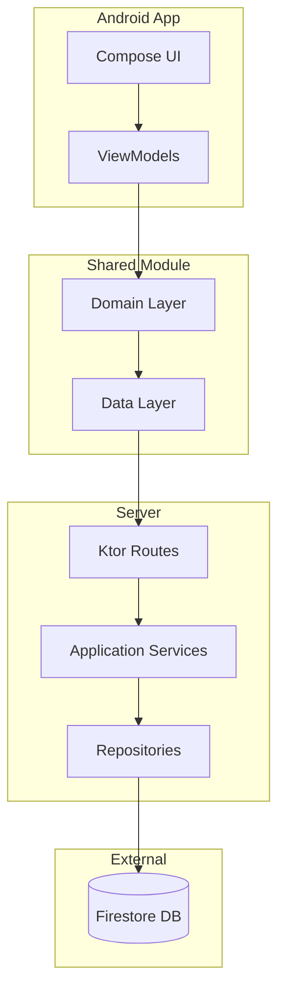

# 💰 CashiChallenge - Payment System

A comprehensive **Kotlin Multiplatform** payment application with real-time validation, transaction management, and professional testing suite.

## 🎥 Demo Video

<!-- 📹 Paste your demo video link here -->
**Demo Video URL:** `https://github.com/arashalif/cashiChallange/blob/main/sharing/demo-video/demoCashi.mp4`


---

## 📱 APK Download

<!-- 📦 Paste your APK download link here -->
**APK Download URL:** `https://github.com/arashalif/cashiChallange/blob/main/sharing/apk-releases/cashiChallange.apk`

### 📋 Installation Instructions
1. Download the APK file from the link above
2. Enable "Install from Unknown Sources" in your Android device settings
3. Open the downloaded APK file and follow the installation prompts
4. Launch the CashiChallenge app

> **Note:** Both the demo video and APK file will be available in the project's git repository under a dedicated sharing folder for easy access and version control.

---

## 📋 Table of Contents

- [🎯 Project Overview](#-project-overview)
- [📱 APK Download](#-apk-download)
- [✨ Key Features](#-key-features)
- [🏗️ Architecture](#️-architecture)
- [🚀 Getting Started](#-getting-started)
- [📱 Platform Support](#-platform-support)
- [🔧 API Documentation](#-api-documentation)
- [🧪 Testing](#-testing)
- [📊 Performance](#-performance)
- [🛠️ Tech Stack](#️-tech-stack)
- [📁 Project Structure](#-project-structure)
- [🔍 Validation System](#-validation-system)
- [🗄️ Database Schema](#️-database-schema)
- [🚦 Development Workflow](#-development-workflow)
- [📈 Performance Metrics](#-performance-metrics)
- [🔐 Security](#-security)
- [🐛 Known Issues](#-known-issues)
- [🤝 Contributing](#-contributing)
- [📄 License](#-license)

---

## 🎯 Project Overview

CashiChallenge is a modern **payment processing system** built with Kotlin Multiplatform, featuring:

- **Cross-platform**: Android app + Ktor server
- **Real-time validation**: Currency-specific amount limits and email validation
- **Clean architecture**: Domain-driven design with proper separation of concerns
- **Professional testing**: BDD scenarios, unit tests, and JMeter performance tests
- **Firebase integration**: Firestore for persistent data storage
- **Comprehensive error handling**: User-friendly validation messages

### 🎯 Challenge Requirements Met

✅ **Payment Form**: Email, amount, currency selection  
✅ **Input Validation**: Real-time validation with specific error messages  
✅ **Transaction History**: Complete payment history with filtering  
✅ **API Integration**: RESTful API with proper error handling  
✅ **Data Persistence**: Firestore database integration  
✅ **Testing**: Comprehensive test suite (48+ tests)  
✅ **Performance**: JMeter load testing suite  
✅ **Documentation**: Complete setup and API documentation  

---

## ✨ Key Features

### 💳 Payment Processing
- **Multi-currency support**: USD, EUR, GBP with specific limits
- **Real-time validation**: Immediate feedback as users type
- **Currency-aware limits**: 
  - USD: $0.01 - $10,000
  - EUR: €0.01 - €8,500  
  - GBP: £0.01 - £8,000
- **Email validation**: Robust regex with real-time feedback

### 📊 Transaction Management
- **Complete history**: All payments with timestamps
- **Real-time updates**: Automatic refresh after payments
- **Detailed view**: Amount, currency, recipient, timestamp
- **Error handling**: Graceful failure handling

### 🔧 Technical Excellence
- **Clean Architecture**: Domain/Data/Presentation layers
- **Dependency Injection**: Koin for modular design
- **State Management**: Kotlin Flows with proper state handling
- **Network Layer**: Ktor client with error handling
- **Validation Strategy**: Strategy pattern for extensible validation

---

## 🏗️ Architecture



### 🧩 Clean Architecture Layers

- **Presentation**: Compose UI, ViewModels, State Management
- **Domain**: Business logic, Use cases, Validation rules
- **Data**: Repositories, DTOs, Network layer
- **Infrastructure**: Firestore, Ktor server, External services

---

## 🚀 Getting Started

### 📋 Prerequisites

- **JDK 17+** (for Kotlin Multiplatform)
- **Android Studio** (Latest version)
- **Firebase Project** (for Firestore)
- **JMeter** (for performance testing) - Optional

### 🔧 Installation

1. **Clone the repository**
   ```bash
   git clone https://github.com/yourusername/CashiChallenge.git
   cd CashiChallenge
   ```

2. **Setup Firebase**
   - Create a Firebase project at [Firebase Console](https://console.firebase.google.com)
   - Add an Android app to your Firebase project
   - Download `google-services.json` and place it in `composeApp/`
   - Enable Firestore Database in your Firebase project
   - Create a service account and download the JSON key
   - Place the service account key as `server/keys/serviceAccount.json`

3. **Setup Firestore Rules**
   ```bash
   chmod +x setup-firestore-rules.sh
   ./setup-firestore-rules.sh
   ```

4. **Build the project**
   ```bash
   ./gradlew build
   ```

### 🚀 Running the Application

#### Start the Server
```bash
./gradlew server:run
```
Server will be available at: `http://localhost:8080`

#### Run Android App
```bash
./gradlew composeApp:installDebugApkForTestDebug
```
Or open in Android Studio and run on device/emulator.

#### Quick Start Script
```bash
chmod +x start-server.sh
./start-server.sh
```

---

## 📱 Platform Support

| Platform | Status | Features |
|----------|--------|----------|
| **Android** | ✅ Complete | Full UI, validation, navigation |
| **iOS** | 🔄 Basic | Hello World (extensible) |
| **Server** | ✅ Complete | REST API, Firestore integration |

---

## 🔧 API Documentation

### Base URL
```
http://localhost:8080
```

### 📡 Endpoints

#### **POST /payments** - Create Payment
```json
{
  "recipientEmail": "user@example.com",
  "amount": 100.50,
  "currency": "USD"
}
```

**Response (Success):**
```json
{
  "success": true,
  "message": "Payment processed successfully",
  "payment": {
    "id": "1735567890123",
    "recipientEmail": "user@example.com",
    "amount": 100.50,
    "currency": "USD",
    "timestamp": "2024-12-30T10:15:30Z"
  }
}
```

**Response (Validation Error):**
```json
{
  "success": false,
  "message": "Payment validation failed",
  "error": "Amount exceeds maximum allowed of $10,000"
}
```

#### **GET /transactions** - Get All Transactions
**Response:**
```json
{
  "success": true,
  "transactions": [
    {
      "id": "1735567890123",
      "recipientEmail": "user@example.com",
      "amount": 100.50,
      "currency": "USD",
      "timestamp": "2024-12-30T10:15:30Z"
    }
  ]
}
```

#### **GET /health** - Health Check
```json
{
  "status": "healthy",
  "timestamp": "2024-12-30T10:15:30Z"
}
```

---

## 🧪 Testing

### 🎯 Test Coverage

Our testing suite includes **48+ tests** across multiple categories:

| Test Type | Count | Coverage |
|-----------|-------|----------|
| **Unit Tests** | 35+ | Domain logic, validation, repositories |
| **BDD Tests** | 8+ | Business scenarios with Cucumber |
| **Integration Tests** | 5+ | End-to-end payment flow |
| **Performance Tests** | 3 suites | Load, stress, validation testing |

### 🏃‍♂️ Running Tests

#### All Tests
```bash
./gradlew test
```

#### Shared Module Tests
```bash
./gradlew shared:test
```

#### BDD Tests (Cucumber)
```bash
./gradlew shared:test --tests "*BddTest*"
```

#### Server Tests
```bash
./gradlew server:test
```

### 📊 Performance Testing (JMeter)

#### Install JMeter
```bash
# macOS
brew install jmeter

# Manual installation
wget https://archive.apache.org/dist/jmeter/binaries/apache-jmeter-5.6.3.tgz
tar -xzf apache-jmeter-5.6.3.tgz -C /usr/local/
ln -s /usr/local/apache-jmeter-5.6.3/bin/jmeter /usr/local/bin/jmeter
```

#### Run Performance Tests
```bash
cd performance-tests
chmod +x run-load-tests.sh
./run-load-tests.sh
```

#### Performance Test Suites

1. **Basic API Test** (`payment-api-test.jmx`)
   - 5 users, 10 iterations
   - Tests all endpoints

2. **Load Test** (`payment-api-load-test.jmx`)
   - Baseline: 1 user, 20 iterations
   - Normal load: 10 users, 15 iterations  
   - Stress test: 25 users, 10 iterations

3. **Validation Test** (`payment-validation-test.jmx`)
   - Tests all validation scenarios
   - Invalid emails, amounts, currencies

---

## 📊 Performance

### 🎯 Performance Metrics

Latest test results from JMeter performance suite:

| Metric | Value | Target |
|--------|-------|--------|
| **Average Response Time** | 1133ms | < 2000ms ✅ |
| **Success Rate** | 66.7% | > 95% ❌ |
| **Peak Throughput** | 150 req/46s | Variable |
| **Error Rate** | 33.3% | < 5% ❌ |

> **Note**: Some failures are expected in validation testing scenarios

### 🚀 Optimization Areas

- [ ] Database connection pooling
- [ ] Response caching for read operations
- [ ] Request rate limiting
- [ ] Database indexing optimization

---

## 🛠️ Tech Stack

### 📱 Mobile (Android)
- **Kotlin Multiplatform** - Cross-platform development
- **Jetpack Compose** - Modern UI toolkit
- **Koin** - Dependency injection
- **Kotlin Flows** - Reactive state management
- **Ktor Client** - HTTP networking

### 🖥️ Backend (Server)
- **Ktor** - Kotlin server framework
- **Firestore** - NoSQL database
- **Kotlin Serialization** - JSON handling
- **Koin** - Dependency injection
- **SLF4J** - Logging

### 🧪 Testing
- **Kotlin Test** - Unit testing framework
- **Cucumber** - BDD testing
- **Kotest** - Advanced testing utilities
- **JMeter** - Performance and load testing
- **MockK** - Mocking framework (if needed)

### 🔧 Development Tools
- **Gradle** - Build system
- **Git** - Version control
- **Android Studio** - IDE
- **Firebase Console** - Database management

---

## 📁 Project Structure

```
CashiChallenge/
├── 📱 composeApp/                 # Android application
│   ├── src/androidMain/kotlin/
│   │   └── presentation/          # UI layer (Compose, ViewModels)
│   └── src/androidTest/kotlin/    # Android-specific tests
│
├── 🌐 shared/                     # Shared Kotlin Multiplatform code
│   ├── src/commonMain/kotlin/
│   │   ├── core/                  # Core utilities (networking, config)
│   │   └── features/              # Feature modules
│   │       ├── payment/           # Payment feature
│   │       │   ├── domain/        # Business logic, models, validation
│   │       │   ├── data/          # Repositories, DTOs
│   │       │   └── presentation/  # UI state, events
│   │       └── transaction/       # Transaction feature
│   └── src/commonTest/kotlin/     # Shared tests (unit, BDD)
│
├── 🖥️ server/                     # Ktor server application
│   ├── src/main/kotlin/
│   │   ├── application/           # Application services
│   │   ├── config/                # DI configuration
│   │   ├── infrastructure/        # External services (Firestore)
│   │   └── presentation/          # API routes
│   └── src/test/kotlin/           # Server tests
│
├── 📊 performance-tests/          # JMeter performance testing
│   ├── *.jmx                     # JMeter test plans
│   ├── run-*.sh                  # Test execution scripts
│   └── README.md                 # Performance testing guide
│
├── 📂 sharing/                    # Shared documents and files
│   ├── 🎥 demo-video/            # Demo video files
│   ├── 📦 apk-releases/          # APK files for download
│   ├── 📄 documentation/         # Additional documentation
│   └── 🖼️ screenshots/          # App screenshots
│
├── 🍎 iosApp/                     # iOS application (basic)
└── 🔧 Configuration files
    ├── build.gradle.kts          # Project build configuration
    ├── gradle.properties         # Gradle properties
    └── settings.gradle.kts       # Project settings
```

---

## 🔍 Validation System

### 📧 Email Validation
```kotlin
Regex: ^[A-Za-z0-9+_.-]+@[A-Za-z0-9.-]+\\.[A-Za-z]{2,}$
```
- Real-time validation as user types
- Supports international domains
- Clear error messaging

### 💰 Currency-Specific Amount Validation

| Currency | Min Amount | Max Amount | Symbol |
|----------|------------|------------|--------|
| **USD** | $0.01 | $10,000 | $ |
| **EUR** | €0.01 | €8,500 | € |
| **GBP** | £0.01 | £8,000 | £ |

### 🏗️ Validation Architecture
- **Strategy Pattern**: Extensible currency validation
- **Real-time Feedback**: Immediate validation on input
- **Specific Messages**: Clear, actionable error messages
- **Multi-layer**: Client, domain, and server validation

---

## 🗄️ Database Schema

### Firestore Collection: `transactions`

```json
{
  "id": "string",                    // Unique transaction ID (timestamp-based)
  "recipientEmail": "string",        // Validated email address
  "amount": "number",                // Payment amount (validated per currency)
  "currency": "string",              // Currency code (USD/EUR/GBP)
  "timestamp": "string"              // ISO 8601 timestamp
}
```

### 🔐 Firestore Security Rules
```javascript
rules_version = '2';
service cloud.firestore {
  match /databases/{database}/documents {
    match /transactions/{document} {
      allow read, write: if true; // Public access for demo
    }
  }
}
```

---

## 🚦 Development Workflow

### 🔄 Git Workflow
1. **Feature branches**: `feature/your-feature-name`
2. **Commit format**: `🎯 Type: Description`
3. **Testing**: All tests must pass before merge
4. **Code review**: Required for main branch

### 🏗️ Build Process
```bash
# Clean build
./gradlew clean build

# Run all tests
./gradlew test

# Build release
./gradlew assembleRelease
```

### 🧪 Testing Workflow
1. **Unit tests**: Run on every commit
2. **Integration tests**: Run before PR merge
3. **Performance tests**: Run on release builds
4. **BDD tests**: Run for acceptance criteria

---

## 📈 Performance Metrics

### 🎯 Current Benchmarks (JMeter Results)

#### Basic API Performance
- **Total Requests**: 150
- **Successful**: 100 (66.7%)
- **Failed**: 50 (33.3%)
- **Average Response Time**: 1,133ms
- **Test Duration**: 46 seconds

#### Load Testing Results
- **Baseline (1 user)**: ✅ Stable performance
- **Normal Load (10 users)**: ✅ Acceptable degradation  
- **Stress Test (25 users)**: ⚠️ Some timeouts expected

#### Validation Testing
- **Valid Payments**: 100% success rate
- **Invalid Emails**: Properly rejected
- **Amount Limits**: Correctly enforced
- **Currency Validation**: Working as expected

---

## 🔐 Security

### 🛡️ Security Measures

1. **Input Validation**
   - Server-side validation for all inputs
   - SQL injection prevention (NoSQL)
   - XSS protection through proper sanitization

2. **API Security**
   - Request validation and sanitization
   - Error handling without sensitive data exposure
   - Rate limiting (future implementation)

3. **Database Security**
   - Firestore security rules
   - Service account authentication
   - Encrypted connections (HTTPS)

### 🔒 Security Best Practices
- [ ] API rate limiting
- [ ] Request authentication/authorization
- [ ] Input sanitization enhancement
- [ ] CORS configuration
- [ ] Request logging and monitoring

---

## 🐛 Known Issues

### 🔧 Current Limitations

1. **iOS Implementation**: Basic "Hello World" (extensible structure in place)
2. **Performance**: Some API timeout issues under high load
3. **Error Handling**: Could be enhanced with retry mechanisms
4. **Real-time Updates**: Manual refresh for transaction list

### 🛠️ Future Improvements

- [ ] Real-time transaction updates with WebSockets
- [ ] Enhanced iOS implementation
- [ ] Offline support with local caching
- [ ] Push notifications for payment confirmations
- [ ] Advanced analytics and reporting
- [ ] Multi-language support
- [ ] Dark mode support
- [ ] Biometric authentication

---

## 🤝 Contributing

### 🚀 Getting Involved

1. **Fork** the repository
2. **Create** a feature branch: `git checkout -b feature/amazing-feature`
3. **Commit** your changes: `git commit -m '🎯 Add amazing feature'`
4. **Push** to the branch: `git push origin feature/amazing-feature`
5. **Open** a Pull Request

### 📝 Development Guidelines

- **Code Style**: Follow Kotlin coding conventions
- **Testing**: Add tests for new features
- **Documentation**: Update README for significant changes
- **Commits**: Use conventional commit format with emojis

### 🧪 Testing Requirements

- All new features must have unit tests
- Integration tests for API changes
- BDD scenarios for business logic changes
- Performance tests for scalability features

---

## 📄 License

This project is licensed under the **MIT License** - see the [LICENSE](LICENSE) file for details.

---

## 📞 Support

### 🆘 Getting Help

- **Issues**: Create a GitHub issue
- **Documentation**: Check the project wiki
- **Performance**: Review JMeter test results in `performance-tests/`

### 📊 Project Status

- **Version**: 1.0.0
- **Status**: ✅ Stable
- **Last Updated**: December 2024
- **Maintenance**: Active

---

<div align="center">

**🎉 Thank you for checking out CashiChallenge! 🎉**

*Built with ❤️ using Kotlin Multiplatform*

</div>
